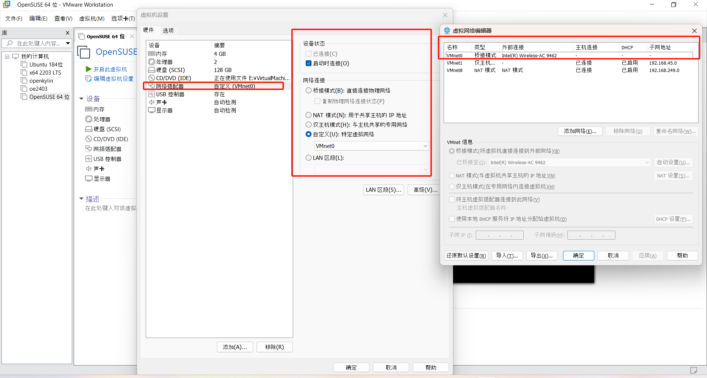
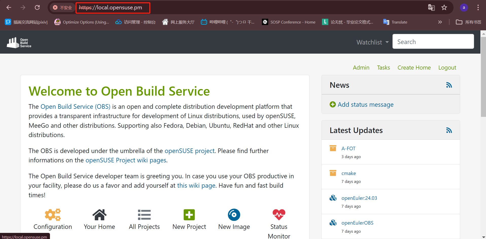
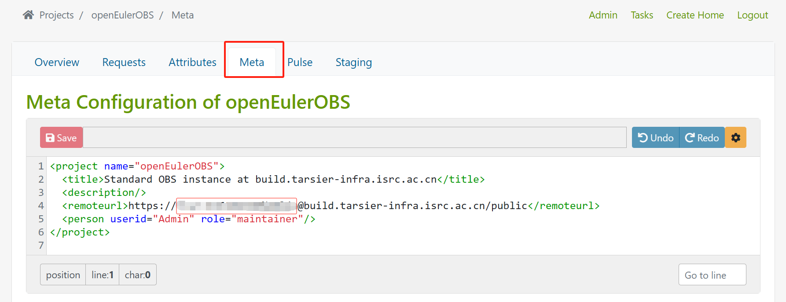
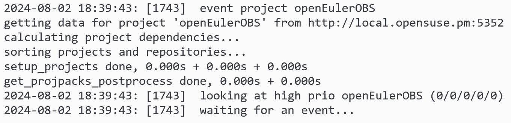
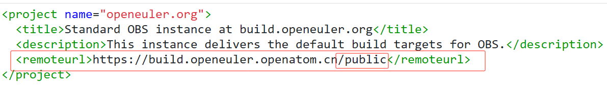
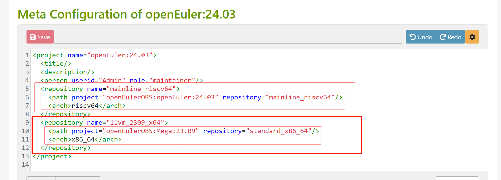
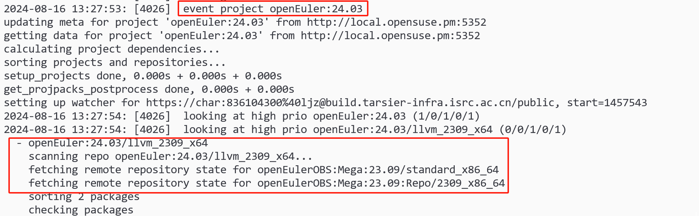
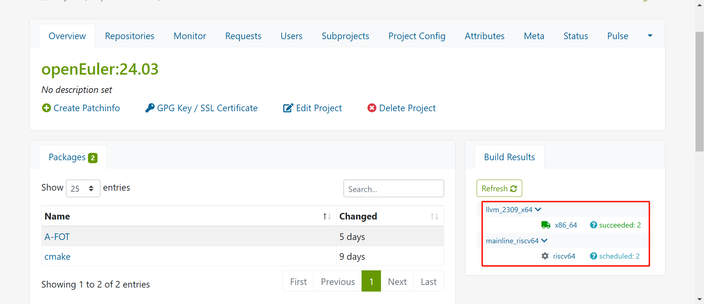
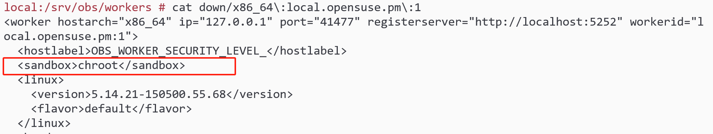
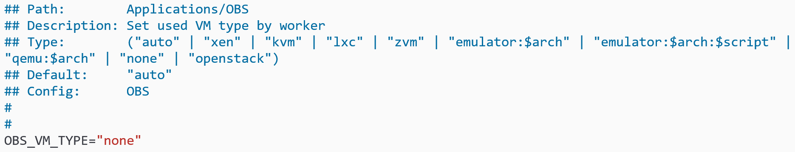

# deploy OBS
## OBS introduction
[参考OBS的介绍文档](https://openbuildservice.org/help/manuals/obs-admin-guide/)。OBS和openSUSE关系非常紧密，文档中直接依赖了其包管理器zypper的pattern特性以下载OBS，这种特性在dnf/yum上是不支持的。

## OBS deployment
### 1.openEuler 24.03部署OBS
[部署记录文档](./images/deploy_obs_on_oe.md)。结果证明oE目前不适合部署OBS。
- openEuler 22.03有相关文档支持在2203上部署OBS server，但是使用的是单独的源，包含了OBS相关和依赖的ruby相关的软件包，OBS版本是2.10.11。
- 根据测试结果，oE 2403中everything中提供了OBS相关包，但是属于废弃包，无法提供完整的OBS运行所需软件，实际oE的构建环境仍然是在openSUSE上部署的，**openEuler暂时不支持部署OBS**

### 2. openSUSE部署OBS
[openSUSE官方文档](https://openbuildservice.org/download/)提供了多种手段用于部署本地的OBS实例，包括：
- 1.包含所有OBS组件并完成初始化的OBS x64镜像
- 2.包含所有OBS组件并完成初始化的VMware虚拟磁盘
- 3.在openSUSE发行版上使用zypper拉取OBS_server模板完成OBS组件安装，并使用OBS提供的自动化脚本完成初始化

**本文档环境配置如下**：
```
1. OBS server部署在x64笔记本上,内存10GB，磁盘256GB
2. OBS版本2.10.22
3. 主机运行Windows 11，主机Linux环境是Ubuntu 22.04 WSL2
4. OBS server和主机在同一局域网下实现互联（通过网线直连/处于同一局域网下实现）
```
#### 2.1 在VMware/物理机器上部署openSUSE
国内源（如中科大源）提供了openSUSE镜像下载，参考openSUSE官方提供的vmdk文件使用的openSUSE 15.5发行版，选择openSUSE 15.5的镜像下载。
- openSUSE对网络配置要求比较严格，在VMware上配置时，首先需要配置一个桥接模式的虚拟网络，外部连接到物理网卡上，并且在vmware中配置网络适配器连接到该虚拟网络中。

同时，在安装虚拟机时，需要指定网卡配置通过DHCP动态获取IP地址。
- 而且，不管在物理环境还是VMware上**因为OBS需要配置hostname供外部访问Web UI，所以建议在配置网络时同时配置DNS hostname，并且确保其可用性**。
#### 2.2 在openSUSE上拉取OBS依赖
根据openSUSE官方教程，执行以下指令添加OBS_server软件源，并且通过zypper拉取OBS_server模板，该步骤会同步拉取所有依赖。
```
zypper ar -f https://download.opensuse.org/ \
repositories/OBS:/Server:/2.10 \
/15.5/OBS:Server:2.10.repo

zypper in -t pattern OBS_Server
```
**注意**：**不要替换国内源!**，国内源落后于openSUSE官方源，在拉取依赖时会找不到符合要求的软件包版本而无法正常工作。在openSUSE 15.5和15.6上可能都存在该问题。
#### 2.3 拉起OBS服务并进行初始化（simple installation）
对于简单部署（OBS实例前后端的所有组件均运行在同一个机器上）OBS提供了初始化的脚本，运行脚本进行初始化。
```
/usr/lib/obs/server/setup-appliance.sh --force
```
openSUSE官方的推荐配置（VMware环境下，simple installation）为
- 4 GB memory
- 1 virtual hard disk of 20 G for / and /var/cache/obs
- 1 virtual hard disk of 50 G for /srv/obs
- a virtual CD-ROM driver pointing to the downloaded ISO image
- network bridging with real Ethernet card
#### 2.4 访问OBS实例
在访问OBS实例之前需要准备好
1. **OBS server和主机网络已连接，且防火墙指定端口打开**：本文档中根据章节2，OBS server和主机位于同一局域网下确保互联。
2. **必须知道OBS server的hostname**：通过hostname查看主机名，本文档中**hostname=local.opensuse.pm**

3. **确保主机可以正确解析OBS server的hostname**：主机在**C:\Windows\System32\drivers\etc下的hosts**文件中对指定hostname绑定IP地址


1，2步的配置测试可以在OBS server上进行，在浏览器中输入
```
https://[hostname]
```
如果OBS server可以正常解析并且访问hostname

可以继续测试主机的浏览器访问OBS server提供的Web UI（**注意网络代理对域名解析可能的影响**）。

注：OBS默认创建Admin用户，default password=opensuse

## OBS bootstrap
### 1.introduction
该部分完全[参考openSUSE官方bootstrap教程](https://en.opensuse.org/openSUSE:Build_Service_private_instance_boot_strapping)

OBS构建软件包依赖于两个东西：
1. Project config：config有自己的语法，[具体参考该文档](https://openbuildservice.org/help/manuals/obs-user-guide/cha-obs-prjconfig)，它用于指定当前project的一些通用构建行为。
2. repo信息：OBS中每个project都有对应的repository的配置，用于指定构建所需的软件包，暂时称之为repo信息，OBS提供了几种方式指定repo信息：
   - from project/distribution：大部分project的repository中的repo信息都是从其它project或一个发行版引用过来。
   - **DoD(download on demand)**：尽管可以互相引用repo信息，但是最终一定有一个起点，这个**最初的repo信息**OBS称之为DoD repo，**本质上是指向一个已有的软件源repo的URL**，OBS从该软件源repo中获取软件包和其内部依赖等信息。   	
   	<details>
	<summary>第一个repo信息</summary>
	严格来说DnD特性是OBS后来引入的，根据编译需要按需从远端仓库中下载软件包，在DnD出现之前，OBS应该仅能通过导入完整的二进程包仓库供编译使用。因为目前oE使用的基本都是DnD，所以本文档将DnD repo作为repo信息的起点。
	</details>

**可以发现，构建软件包依赖现成的软件包，这是一个先有鸡还是先有蛋的问题**。整个**bootstrap的核心**是：**为OBS提供构建软件包所需的工具链（toolchain）**。**toolchain本身必须是已经编译好的软件包，OBS并不能从0开始完成软件包的构建**(因此应当尽可能复用已有的软件源repo，从头开始构建一个repo是非常耗时和痛苦的)

openSUSE官方在文档中详细描述了几种bootstrap的流程，但是因为使用的资源过老和过于复杂，基本无法参考。所以**本章节仅介绍最简单的基于已有的openEuler OBS实例和openEuler repo进行构建的流程[1]**。

### 2.通过interconnect完成bootstrap
[前面章节](#1introduction)说明了OBS构建软件包需要Project Config和repo信息，而Interconnect可以将本地project和远程project连接起来，在构建时本地OBS可以直接从远端project同步Project config和repo信息，非常方便。
#### 2.1 添加interconnector
**interconnect的目标是在本地OBS实例为远程OBS实例提供一个接入点（暂时称接入点为interconnector，以project的形式提供）**，[参考中科院的OBS实例(下称为tarsier)接入点设置](https://build.tarsier-infra.isrc.ac.cn/projects/openeuler.org/meta)[2]。本文档以tarsier为例，设置接入点meta信息如下图[3]:

接入点是否正常工作可以查看/obs/srv/log(默认OBS配置的log目录)下scheduler的日志，下图是scheduler_x86_64的日志，正常向远端OBS发起请求。


**注意：**
1. OBS默认的worker配置是针对OBS运行的主机架构的，即如果OBS运行在x86_64的主机上，则OBS仅能基于x86_64 repo构建x86_64的软件包。**因此下文中未指定架构的配置均默认采用与OBS实例同架构者。**
2. [openEuler的OBS](https://build.openeuler.openatom.cn)可能因为安全策略无法用于设置接入点，返回error 500
3. 通常OBS实例都会提供public接口，且该接口一般允许匿名用户的请求(如下图，URL中并未指定user@password)，因此接入点通常设在该接口上。但是在本地部署时发现tarsier不允许本地OBS以匿名用户的方式发起请求。因此在设置tarsier的接入点时带上了user@password（在tarsier上注册的用户）（上图）

#### 2.2 通过interconnector获取repo信息
其它project可以通过import from project的方式从interconnector中获取repo信息和project config。本例中OBS实例存在两个project：
- interconnector，名字为openEulerOBS
- 实际用于构建的project，名字为openEuler:24.03

openEuler:24.03需要从interconnector中获取构建所需信息，下图引用了两个repo，分别供x86_64和riscv64两种架构构建

注：
1. 需要提前知道**远端OBS实例上对应的项目名:repo名**，引用形式为 **[interconnector name]:[project name]:[repo name]**
2. 引用结果可以查看对应架构scheduler_@arch的日志，这里展示的是添加llvm_2309_x64 repo后OBS的日志，包含了部分构建日志（更新repo时自动触发构建）。

#### 2.3 结束bootstrap
完成2.1和2.2后，最简单的bootstrap流程已经完成，OBS此时已经可以从远端OBS直接获取所需的repo信息和project config了。

### 3.构建第一个软件包
完成了bootstrap后，OBS已经准备好构建软件包了，本章节会介绍如何在本地OBS实例上创建和构建第一个包（如果OBS可以正常构建，使用osc本地构建同样可以正常执行，而osc的使用相对简单，可以直接参考openSUSE官方文档）。
OBS构建软件包的流程大概如下：
1. 创建软件包：添加软件包源码，patches和spec文件。如果使用了外部SCM，则OBS会访问SCM获取软件包信息（此时需要等待同步完成，blocked状态）。
2. 分发软件包：当前软件包创建成功后，OBS首先会调度该任务（scheduled状态），尝试寻找可用worker。
3. 构建软件包：如果找到了可用的worker，OBS会尝试构建该任务（building状态），可分为以下几个步骤：
	- preinstall：worker根据软件包使用的包类型创建base system用于安装依赖。
	- install：worker根据软件包配置启动并进入构建环境（如KVM，chroot等），然后基于base system和repo信息安装所需软件包（**意味着会重装base system中安装的软件包**），直到构建配置中所有的依赖都被安装
	- build：worker会根据软件包类型选择对应的构建工具进行构建
	- after build：worker完成构建后，会将构建好的包从构建环境发布到server上。
#### 3.1 创建第一个软件包
OBS构建的最小单位是package，每个package经过构建会生成一个软件包。一个package通常包含几个部分：
- spec文件：用于定义OBS对当前包的构建行为
- 软件源码：通常以tar包的形式提供，可能会进行进一步的压缩，如对tar包用xz进行压缩
- patches：源码的tar包一般是直接从上游获取，未经过修改的源码。如果需要进行定制化修改，一般以git patch的形式随软件tar包一起提供。OBS在解压tar包之后可以在spec中告知OBS按次序应用patch

为了简化软件包的管理，OBS提供了**与外部SCM（Source Management，如git）交互的能力**，可以将package的内容存放在git等SCM上，OBS实例上仅需要将pacakge与SCM上对应的repo关联起来，并通过_service文件管理连接。

因此，如果需要创建软件包，则需要创建对应的package，因为openEuler上package的主要内容已经在gitee上提供了，本文档主要介绍如何编写_service文件建立package到git repo的连接。

一个基本的_service文件（足以覆盖大部分场景）如下例：
```
<services>
	<service name="tar_scm">
		<param name="scm">git</param>
		<param name="url">https://gitee.com/src-openeuler/A-FOT.git</param>
		<param name="revision">openEuler-24.03-LTS</param>
		<param name="exclude">*</param>
		<param name="extract">*</param>
	</service>
</services>
```
其中主要需要注意下面的参数：
- scm：指定package使用的SCM类型
- url：指定使用的SCM repo的URL
- revision：指定repo中的指定版本（git分支）
	<details>
	<summary>git拉取代码问题</summary>
	OBS以obsrun用户的身份拉取代码，因此如果需要ssh密钥拉取代码时，必须为obsrun用户配置ssh密钥，否则只能使用https拉取代码
	</details>

通常情况下仅需修改这些参数就可以实现使用用户自己的代码进行构建。
#### 3.1.1 手动创建第一个软件包
_service文件有两种手动创建方式：
- 通过OBS的web UI：_service文件可以直接在OBS提供的web UI上添加和编辑并保存。
- 通过osc：可以在OBS上先创建新的package，通过osc将package拉取到本地，然后按以下步骤添加_service文件并同步到OBS实例：
   - 在package的目录下创建并编辑_service文件。
   - 通过osc add _service命令追踪该文件。
   - 通过osc commit并添加日志将该文件同步至OBS实例。
#### 3.1.2 从其它project导入package
除了手动创建_service文件，osc的copypac命令能在不同OBS实例project间拷贝package。
```
命令：
osc -A ${SRC_OBS_INSTANCE} \
copypac -t ${DEST_OBS_INSTANCE} \
${SRC_PROJECT} ${PACKAGE_NAME} \
${DEST_PROJECT}

下例：
osc -A https://build.tarsier-infra.isrc.ac.cn \
copypac -t https://local.opensuse.pm \
openEuler:24.03 A-FOT \
openEuler:24.03
```
#### 3.1.3 拉取代码
完成_service文件后，OBS会自动判断文件名，并从远端获取文件信息和索引。

#### 3.1.4 配置obsrun用户的ssh密钥（待补充 ）
#### 3.2 准备构建软件包
当一个package创建好时，OBS会主动开始构建软件包，此时可以在web UI的project页面看到当前流程[1]

#### 3.2.1 配置worker
当前worker的配置状态可以在/srv/obs/worker的目录下查看，该目录下有building/idle/down三个文件夹，分别对应三种worker的状态。这些目录下的文件是自动生成的，仅用于查看worker配置，修改无效。

主要注意**sanbox参数**，按照[openSUSE官方文档](https://openbuildservice.org/help/manuals/obs-user-guide/cha-obs-build-process)
,**sanbox定义了该worker使用何种buildroot(build environment)**,如chroot等。每个软件包可以指定自己希望的buildroot。

sanbox的配置**在/etc/sysconfig/obs-server**文件中的**OBS_VM_TYPE**项[3]完成设置之后通过rcobsworker restart使配置生效。


**注意：**
1. **OBS在schedule任务之后，后端会不断检查当前是否有架构符合软件包使用的repo信息的worker，如果没有，OBS会一直等待，比如图中使用riscv64 repo因为没有对应架构的worker，所以会卡死在scheduled状态**
2. VM_TYPE设置成none则worker使用的buildroot是chroot,测试中OBS默认的VM_TYPE是auto，实际使用的buildroot是KVM，无法正常进行构建。

#### 3.2.2 构建软件包
完成bootstrap和worker配置后，目前OBS应当可以正常构建软件包。